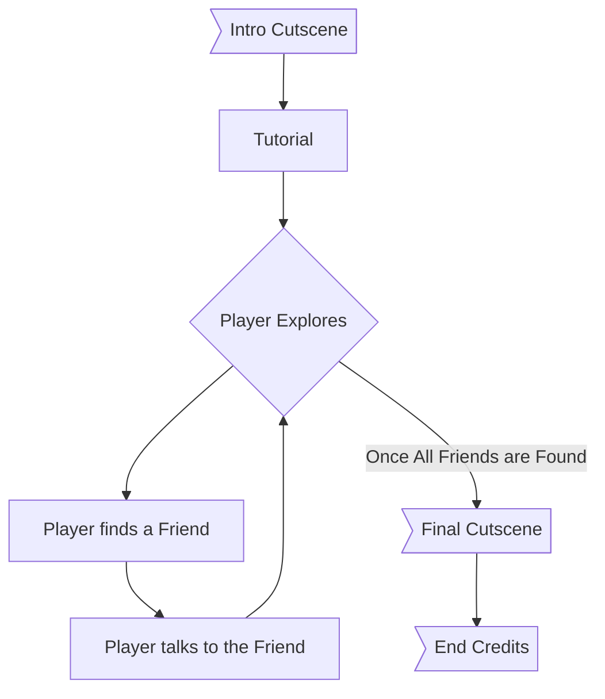
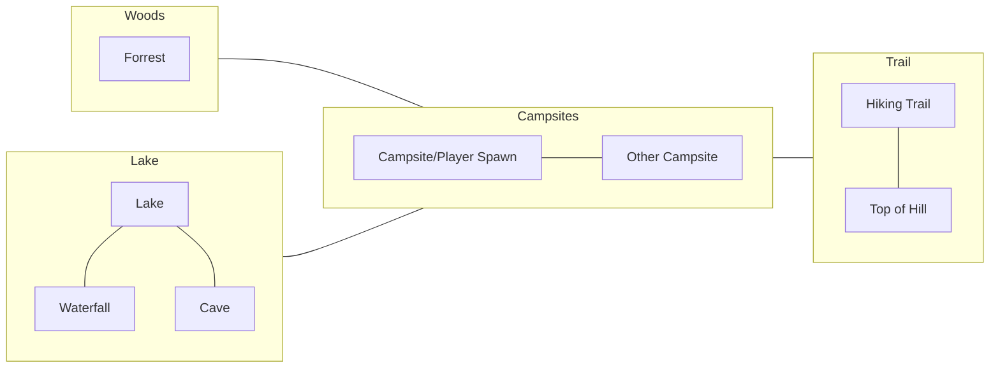

*last updated {{fm.updated}}*

## Gameplay

Core gameplay would be a top-down, 3D "platformer." Movement is currently analogous to that of Animal Crossing. The player would traverse the small world to find their friends.

The flow of the game, from start to finish, is modeled below:

Exploring the world could consist of small, non-punishing platforming sections as well as a few small puzzles (potentially, I'm still thinking about this).

## Difficulty

As this game is meant to be a medium for me to display my findings, I am aiming for the game to be completely approachable for novice/casual players. There are no current plans for other difficulties.

The game is meant to be a completely relaxing experience, though ~~there may be optional challenges available~~. 
> *(Update: There will be none. Developing these "challenges" would take too much time)*

There is no way to lose the game - there are no lives, there is no punishment for falling off obstacles, and there are no penalties for taking your time.

## World/Map Design

The graph below is a hypothetical map of the play area:

